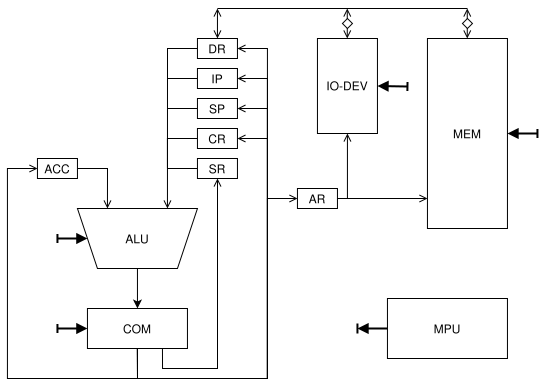
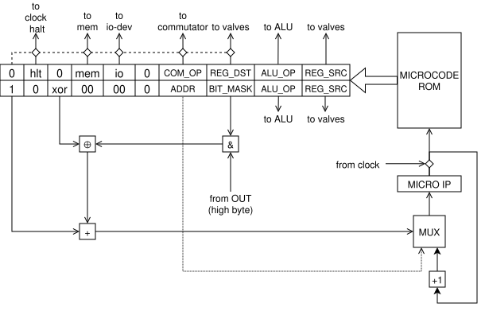

# Лабораторная работа №4

- **ФИО:** Гребенюк Леонид Сергеевич
- **Группа:** P3232
- **Вариант:** `asm | acc | neum | mc | tick | binary | stream | port | pstr | prob1 | pipeline`

## Язык программирования

```bnf
<program>        ::= { <line> }
<line>           ::= <preproc-line> | <code-line>

; --- препроцессор ---
<preproc-line>   ::= "#define" <identifier> [ <text> ]
                   | "#ifdef" <identifier>
                   | "#ifndef" <identifier>
                   | "#else"
                   | "#endif"

; --- основная строка ---
<code-line>      ::= { <label> } [ <statement> ] [ <comment> ]
<label>          ::= <identifier> ":"
<statement>      ::= <directive> | <instruction>
<comment>        ::= ";" { <любой-символ-кроме-перевода-строки> }

; --- директивы ---
<directive>      ::= ".org" <number>
                   | ".word" <value>
                   | ".byte" <value>
                   | ".str" <string>
                   | ".text"
                   | ".data"

; --- инструкции ---
<instruction>    ::= <noarg-op>
                   | <value-op>  <immediate>
                   | <io-op>     <port>
                   | <mem-op>    <mem-operand>
                   | <branch-op> <addr-operand>

<noarg-op>       ::= "NOT" | "NEG" | "INC" | "DEC" | "SHL" | "SHR" | "ASL" | "ASR"
                   | "CLO" | "CLC" | "SSP" | "RET" | "HLT"
<value-op>       ::= "LDIM" | "ADDIM"
<io-op>          ::= "RD" | "WR"
<mem-op>         ::= "LD" | "ST" | "ADD" | "SUB" | "MUL" | "DIV"
                   | "ADC" | "CMP" | "AND" | "OR" | "XOR"
<branch-op>      ::= "JMP" | "BEZ" | "BLZ" | "BGZ" | "BCS" | "BCC"
                   | "BOS" | "BOC" | "CALL"

; --- операнды ---
<mem-operand>    ::= "(" <address> ")"            ; прямая адресация
                   | "(" "[" <address> "]" ")"    ; косвенная адресация
<addr-operand>   ::= "(" <address> ")"            ; цель перехода
<immediate>      ::= <value>                      ; беззнаковый 24-битный
<port>           ::= <number>                     ; 0..7 (RD — чётный, WR — нечётный)
<address>        ::= <identifier> | <number>
<value>          ::= <identifier> | <number>

; --- лексика ---
<identifier>     ::= <alpha> { <alpha> | <digit> }
<alpha>          ::= "A".."Z" | "a".."z" | "_"
<number>         ::= [ "-" ] <decimal> | "0x" <hex-digits>
<decimal>        ::= <digit> { <digit> }
<string>         ::= '"' { <str-char> | <escape> } '"'
<escape>         ::= "\n" | "\t" | "\\" | "\"" | "\0" | "\" <любой-символ>
```

### Семантика

- **Модель вычислений:** Аккумулятор -- единственный регистр, явно доступный программисту, все бинарные операции выполняются между аккумулятором и памятью.
- **Строки:** Length-prefixed pascal string (`pstr`), в памяти хранятся посимвольно (один символ == размер DR == 32 бита).
- **Размер данных:** доступны директивы `.byte` и `.word` для соответственно значений 1 байт (упакованного в 32 бита) и 4 байта.
- **Область видимости:** все метки глобальны и видны как после, так и до места объявления.
- **Препроцессор:** директивы препроцессора аналогичны языку C.

## Организация памяти

- **Архитектура:** Фон-Неймановская (`neum`).
- **Машинное слово:** 32 бита.
- **Адресация:** Прямая, косвенная, непосредственная. Доступ к памяти происходит по байтам, за одну операцию чтения в 32-битный DR записываются значения 4 ячеек памяти.
- **Отображение памяти:** Данные и код располагаются в том же порядке, что и в ассемблерном коде с учётом директив `.org`.
- **Отображение переменных:** Переменные всегда отображаются на адрес в памяти.
- **Стек:** Растёт вверх, начало стека определяется самим программистом, аппаратной защиты нет.

## Ввод-вывод

Ввод-вывод **портовый** (`port`), **потоковый** (`stream`). 8 байтовых портов, выбор one-hot по младшему байту регистра адреса. Порты с чётными номерами -- вход, с нечётными -- выход. Чтение из пустого входа останавливает процессор.

## Система команд

- **Регистры процессора:**
  - `ACC` (Accumulator) -- Аккумулятор.
  - `IP` (Instruction Pointer) -- Счётчик команд.
  - `DR` (Data Register) -- Регистр данных (для чтения и записи в память и устройства ввода-вывода).
  - `CR` (Command Register) -- Регистр текущей инструкции.
  - `SP` (Stack Pointer) -- Указатель вершины стека.
  - `AR` (Address Register) -- Регистр адреса (для чтения и записи в память и устройства ввода-вывода).
  - `SR` (State Register) -- Регистр состояния (для флагов N, Z, O, C).

- **Машинный код:** Представляется в настоящем бинарном виде (`binary`), инструкции переменной длины (1/4/5 байт):
  - Опкод -- 8 бит (в том числе бит адресации).
  - **Noarg** -- команда без операнда, 8 бит (только опкод).
  - **Value** -- команда с непосредственной адресацией, 32 бита (опкод + 24 бита операнд).
  - **Addr** -- команда с прямой/косвенной адресацией, 40 бит (опкод + 32 бита адрес).
  - **Label** -- команда перехода (только прямая адресация), 40 бит (опкод + 32 бита адрес).
  - **Byteaddr** -- команда с байтовым адресом (адрес устройства ввода-вывода), 32 бита (опкод + 0x00 + 0x00 + байт one-hot адреса).

### Набор инструкций

Выборка инструкции (`AR<-IP; CR<-mem[AR]`) едина для всех и занимает **2 такта**.

| Мнемоника | Опкод | Тип | Действие | Тактов |
|---|:---:|---|---|:---:|
| `LD`   | `0x27` | addr | `ACC <- mem[m]` | 17 / 19* |
| `ST`   | `0x26` | addr | `mem[m] <- ACC` | 16 / 18* |
| `LDIM` | `0x37` | value | `ACC <- imm24` | 10 |
| `ADDIM`| `0x36` | value | `ACC <- ACC + imm24` | 11 |
| `ADD`  | `0x0F` | addr | `ACC <- ACC + mem[m]` | 17 / 19* |
| `SUB`  | `0x0E` | addr | `ACC <- ACC - mem[m]` | 17 / 19* |
| `ADC`  | `0x0B` | addr | `ACC <- ACC + mem[m] + C` | 16 / 18* |
| `MUL`  | `0x0D` | addr | `ACC <- ACC × mem[m]` (знак., младшие 32 бита) | 17 / 19* |
| `DIV`  | `0x0C` | addr | `ACC <- ACC / mem[m]` (знак., к нулю; /0 → `O=1`) | 17 / 19* |
| `CMP`  | `0x0A` | addr | `ACC - mem[m]`, только флаги | 16 / 18* |
| `AND`  | `0x07` | addr | `ACC <- ACC & mem[m]` | 18 / 20* |
| `OR`   | `0x06` | addr | `ACC <- ACC \| mem[m]` | 18 / 20* |
| `XOR`  | `0x05` | addr | `ACC <- ACC ^ mem[m]` | 17 / 19* |
| `INC`  | `0x01` | noarg | `ACC <- ACC + 1` | 12 |
| `DEC`  | `0x00` | noarg | `ACC <- ACC - 1` | 12 |
| `NEG`  | `0x02` | noarg | `ACC <- -ACC` | 12 |
| `NOT`  | `0x03` | noarg | `ACC <- ~ACC` | 12 |
| `SHL`  | `0x17` | noarg | логический сдвиг влево на 1 | 12 |
| `SHR`  | `0x16` | noarg | логический сдвиг вправо на 1 | 12 |
| `ASL`  | `0x15` | noarg | арифм. сдвиг влево (`C`=старший) | 12 |
| `ASR`  | `0x14` | noarg | арифм. сдвиг вправо (`C`=младший) | 12 |
| `CLC`  | `0x12` | noarg | `C <- 0` | 11 |
| `CLO`  | `0x13` | noarg | `O <- 0` | 11 |
| `RD`   | `0x25` | byteaddr | `ACC <- байт из входного порта` | 12 |
| `WR`   | `0x24` | byteaddr | `выходной порт <- ACC[7:0]` | 12 |
| `JMP`  | `0x1F` | label | `IP <- t` | 15 |
| `BEZ`  | `0x1E` | label | переход если `Z=1` (`= m`) | 15 / 14** |
| `BLZ`  | `0x1D` | label | переход если `N xor O = 1` (`< m` знак.) | 16 / 15** |
| `BGZ`  | `0x1C` | label | переход если `N xor O = 0` (`≥ m` знак.) | 16 / 15** |
| `BCS`  | `0x1B` | label | переход если `C=1` (`≥ m` беззнак.) | 15 / 14** |
| `BCC`  | `0x19` | label | переход если `C=0` (`< m` беззнак.) | 15 / 14** |
| `BOS`  | `0x1A` | label | переход если `O=1` | 15 / 14** |
| `BOC`  | `0x18` | label | переход если `O=0` | 15 / 14** |
| `CALL` | `0x2F` | label | `SP+=4; mem[SP]<-возврат; IP<-t` | 16 |
| `RET`  | `0x2E` | noarg | `IP<-mem[SP]; SP-=4` | 14 |
| `SSP`  | `0x2D` | noarg | `SP <- ACC` | 9 |
| `HLT`  | `0x3F` | noarg | останов | 6 |

`*` -- прямая / косвенная адресация

`**` -- произошёл / не произошёл переход

## Транслятор

Транслятор (`assembler.py`) реализован в несколько стадий:
препроцессор -> токенизация -> первый проход -> второй проход.

На этапе препроцессора раскрывается условная компиляция и макросы. На этапе токенизации отделяются комментарии и пустые строки и происходит нумерация инструкций. На первом проходе определяются положения меток, директивы `.org`. На втором происходит трансляция ассемблерного кода в бинарный.

Транслятор может генерировать листинг.

Запуск:
```bash
python3 assembler.py prog.asm prog.bin --listing prog.lst
```

`prog.bin` и `prog.lst` необязательные параметры, они могут сгенерироваться из `prog.asm`.

## Модель процессора

Процессор моделируется с точностью до такта (`tick`). Управление построено на микрокоде (`mc`).

### Схема Datapath и Control Unit

#### Datapath

АЛУ имеет два входа: `IN1` и `IN2`, выход `ALU_OUT`, и управляющие входы. Коммутатор имеет вход `COM_IN`, выход `OUT`, вывод состояния флагов и управляющие входы. Со входом АЛУ `IN1` соединён регистр `ACC`, со входом `IN2` регистры `IP`, `DR`, `SP`, `CR` и `SR`. Если все вентили от регистров к АЛУ закрыты, то на входе установлен 0. Выход АЛУ `ALU_OUT`, подаётся на вход коммутатора `COM_IN`. Выход коммутатора `OUT` подключен к регистрам, кроме `SR`, к `SR` подключен вывод состояния флагов с коммутатора. Подать адресный регистр на вход АЛУ невозможно, в него можно только записать данные. Регистр данных подключен к шине данных, к которой так же подключены память и устройства ввода-вывода. Управляющие входы АЛУ, коммутатора, регистры и шина данных подключены к устройству микропрограммного управления, от которого получают сигнал (с помощью операционных микрокоманд).



#### Control Unit

Устройство микропрограммного управления состоит из ПЗУ для микрокоманд, счётчика микрокоманд, блока управления счётчиком и шин данных от и к datapath: регистрам, памяти, устройств ввода-вывода. Прочитанная микрокоманда либо влияет на datapath (операционная микрокоманда), либо влияет на счётчик микрокоманд в соответствии с условием микрокоманды.



#### Микрокоманды

Ширина -- 48 бит (6 байт). Тип определяется старшим битом:
- **Операционная** (бит = 0) управляет DataPath.
- **Управляющая** (бит = 1) управляет МПУ, используется для выбора операционных микрокоманд в зависимости от опкода.

|размеры в битах            |1|1  |1  |2  |2 |1|8     |8       |16    |8      |
|---|---|---|---|---|---|---|---|---|---|---|
| операционная микрокоманда |0|hlt|0  |mem|io|0|COM_OP|REG_DST |ALU_OP|REG_SRC|
| управляющая микрокоманда  |1|0  |xor|00 |00|0|ADDR  |BIT_MASK|ALU_OP|REG_SRC|

| Поле | Назначение |
|---|---|
| hlt | останов |
| mem | запись / чтение памяти |
| io | запись / чтение порта |
| COM_OP | операция коммутатора |
| REG_DST | регистры записи результата |
| ALU_OP | операция АЛУ |
| REG_SRC | регистры, подающие на вход в АЛУ |
| xor | бит условия перехода. Если (((результат АЛУ & BIT_MASK) > 0) XOR (xor)) == 1, выполняется переход на микрокоманду ADDR, иначе выполняется следующая микрокоманда |
| ADDR | адрес микрокоманды, на которую нужно перейти, если выполняется условие |
| BIT_MASK | маска для выбора бита результата АЛУ для сравнения с битом xor |

**Кодирование полей:**

| Поле (№ бита) | Значения |
|---|---|
| REG_SRC/REG_DST | `ACC=0 IP=1 DR=2 CR=3 SP=4 AR=5 SR=6` |
| ALU | `AND=0 OR=1 NOT=2 XOR=3 NEG=4 ADD=5 SUB=6 MUL=7 DIV=8 ADC=9 CMP=10 INC=11 DEC=12 ADD4=13` |
| COM | `VAL=0 SHL=1 SHR=2 ASL=3 ASR=4 CLO=5 CLC=6 PASS=(нули на всех битах)` |
| FLAG (в `SR`) | `N=0 Z=1 O=2 C=3` |

### Цикл исполнения

1. **FETCH** (2 такта): `AR <- IP`; `CR <- mem[AR]`.
2. **DECODE**: двоичное дерево по битам опкода 5,4,3, затем по битам 2,1,0.
3. **Чтение операнда**: для 4-байтных команд операнд уже в `CR[23:0]`, `IP+=4`; для 5-байтных — `IP+=1`, чтение 32-битного операнда в `DR`, `IP+=4`.
4. **Косвенность** (только `addr`): `mem[mem[m]]`.
5. **Исполнение** через АЛУ/коммутатор, запись результата, возврат к FETCH.

## Тестирование

Код покрыт golden тестами для проверки корректности трансляции и исполнения.
Исхходные коды и параметры тестов лежат в каталоге `examples/`.

Реализованные алгоритмы:

1. `hello` -- вывод "Hello, world!".
2. `cat` -- чтение из потока ввода и вывод до завершения.
3. `hello_user_name` -- чтение имени из ввода и приветствие пользователя.
4. `sort` -- сортировка массива чисел.
5. `dpsum` -- 64-битное сложение через флаг переноса.
6. `prob1` -- Project Euler #4, наибольший палиндром, равный произведению двух трёхзначных чисел.
7. `macros` -- подстановка макросов `#define`.
8. `cond` -- условная трансляция: `#ifdef` / `#ifndef` / `#else` / `#endif`.
9. `org` -- директива `.org`.

Запуск всех тестов:

```bash
pytest
```
